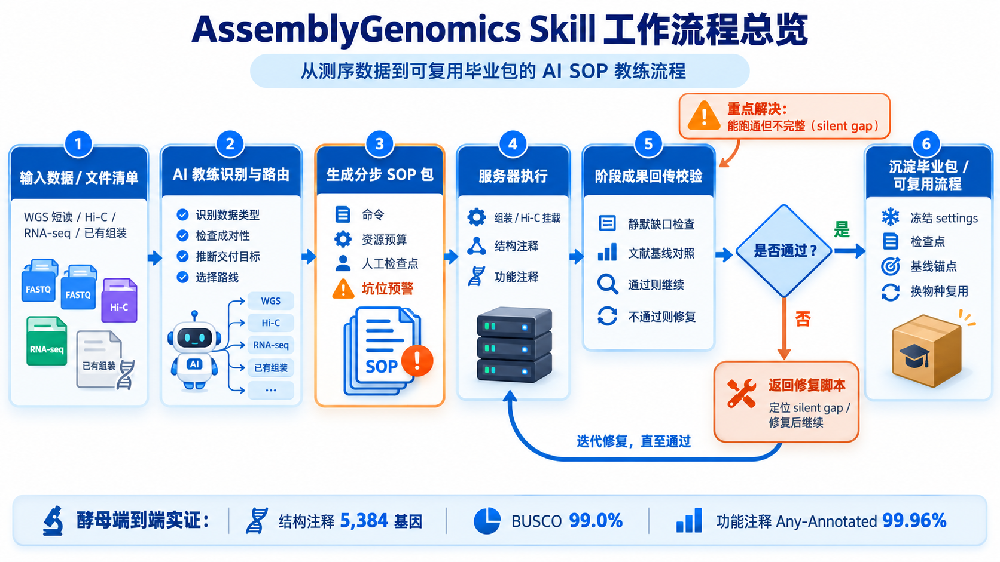

# AssemblyGenomics Skill

基因组组装与注释的 **SOP 教练**。把测序数据和交付目标交给它，它告诉你：手里有哪些数据、该走哪条路线、每一步怎么做、这一步有什么坑——并生成能直接在服务器上跑的分步 SOP 包。已在酵母全流程端到端实证（结构注释 5,384 基因 / BUSCO 99.0%，功能注释 Any-Annotated 99.96%）。

## 为什么存在

组装/注释流水线最阴险的失败不是"报错"，而是**能跑通但不完整**（silent gap）：库版本过旧、参数被默认值吞掉、注释只覆盖了 4% 的基因——全程零报错，直到交付才发现。本 skill 把专家踩坑经验代码化，并用**文献基线锚点**回答新手最缺的问题："我这个数正常吗？"

## 它能帮你做什么

- **认数据**：随手丢一份文件清单，自动识别 WGS 短读 / Hi-C / RNA-seq / 已有组装，检查成对性，并推断交付目标（如从 hap1/hap2 文件名识别出"单倍型交付"）
- **定路线**：根据数据与目标推荐流程——从原始读段组装、已有组装接续 Hi-C 挂载，到结构注释与功能注释
- **出 SOP**：生成可逐段执行的 SOP 包：每步含命令、资源预算、必须人工介入的检查点（如 Hi-C 的 Juicebox 校正）
- **预警坑**：每一步挂载真实踩坑库——9 条真实事故种子（Dfam 旧库、TSEBRA 阈值、单外显子过滤的物种依赖……），带可执行检查脚本，专抓"能跑通但不完整"
- **验结果**：阶段成果回传后自动校验——静默缺口检查 + 基线对照，通过就发下一段 SOP，不通过就给修复脚本
- **可复用**：全流程跑通后沉淀**毕业包**（冻结 settings + 检查点 + 基线锚点），换物种按同一套流程复用

## 工作流程



## 快速开始

依赖：Python ≥3.9 + `jsonschema` + `PyYAML` + `pytest`。克隆仓库即可运行：

```bash
# 识别数据 → 路由 → 生成带坑位预警的分步 SOP（示例文件名）
python scripts/skill_coach.py SM_WGS_1.fq.gz SM_WGS_2.fq.gz SM_hic_all_1.fq.gz SM_hic_all_2.fq.gz

# 静默缺口体检（9 条真实陷阱探测器）
python scripts/run_pitfall_checks.py

# 结果基线对照："这个数正常吗？"
python scripts/check_baselines.py --taxon actinopterygii protein_coding_gene_count=23864

# 全量回归（117 tests）
python -m pytest -q
```

完整玩法见 [SKILL.md](SKILL.md)。

## 安装为 Codex 技能

本技能包面向 **Codex CLI**：包内含 `AGENTS.md`（每次会话自动携带的方法论与硬约束）+
`commands/assembly-genomics.md`（按需触发的 slash 命令）+ 全部资产（scripts/knowledge/references…）。

1. **获取包**：克隆仓库（`git clone https://github.com/JunyangLian/AssemblyGenomics-Skill.git`），
   在仓库根运行 `python scripts/package_skill.py` 生成 `dist/assembly-genomics-<ver>.zip`（dist/ 不入库）；
2. **安装**（PowerShell / bash 均可）：

   ```powershell
   # 一键安装到 ~/.codex（AGENTS.md + commands/ + 资产）
   python scripts/package_skill.py --install
   # 或手动：解压 zip，将 AGENTS.md 放入 ~/.codex/AGENTS.md，
   #         commands/assembly-genomics.md 放入 ~/.codex/commands/，
   #         资产目录保留在 ~/.codex/assembly-genomics/
   ```

之后每个 codex 会话自动携带本方法论；输入 `/assembly-genomics`（或描述"基因组组装/注释"类任务）触发完整流程。`~/.codex/AGENTS.md` 已存在时会拒绝覆盖并提示手工合并。

## 目录结构

```text
SKILL.md                    # 入口文档（触发说明、硬约束、工作循环）
references/                 # 路由/表示/门控策略
schemas/ scripts/ templates/  # 校验器、路由、SOP 脚手架
knowledge/pitfalls/         # 9 条真实陷阱（含检查脚本）
knowledge/baselines/        # 类群兜底带（项目锚点优先）
sop/yeast_loop/             # 毕业包：四段 SOP + 冻结 settings + 检查点（酵母实证）
docs/                       # 决策记录、能力矩阵、用例实录、run_registry
tests/                      # 117 tests
```

## 路线图

- 三倍体葡萄（短读 + Hi-C、单倍型分套交付）：毕业包换物种复用的第一次实战
- GeneMark-ETP 缺陷修复后回归 ETP 模式，补齐蛋白证据
- 陷阱库与基线随每个真实案例持续扩充

## License

MIT License（Copyright (c) 2026 25jylian）· Hosted on GitHub：<https://github.com/JunyangLian/AssemblyGenomics-Skill>
